<h1 align="center"> 
  Solo-Project
</h1>

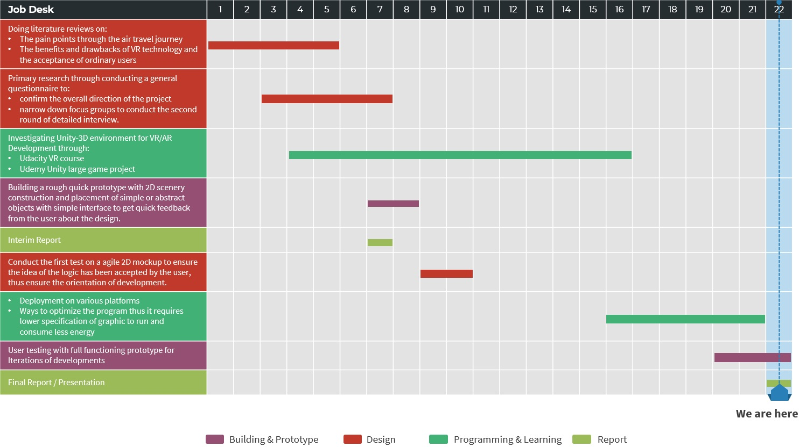

> The following table has excluded the time for learning the implementation techniques

<!--- the table will appears as random mess in Markdown edit software but works absolutely fine on Github--->

| MISSION                     | START DATE | END DATE |
|-----------------------------|------------|----------|
| **Navigation Path Finding** |            |          |
| Generating Mesh             |     25/Mar |   28/Mar |
| Waypoints                   |     29/Mar |   30/Mar |
| Nav Agent                   |     31/Mar |   10/Apr |
| **Animations**              |            |          |
| Animation State Machine     |     15/Apr |   19/Apr |
| Mecanim with Navigation     |     20/Apr |   30/Apr |

<!------------------------------------------------------------------------------------>

## Navigation and Path Finding

This session will be all focusing on the development of a system by which the artificial intelligence (AI) will be able to navigate non-player characters (NPC) around the environment.

- Navigation and Path Finding
- Exploring the A* Search algorithm to efficiently locate paths in navigation graphs
- Working with Unity's Navigation System
- `Mecanim` Root Motion and Navigation Systems working in harmony

### Generating the Correct NavMesh

#### Understanding the Theory & Terms

The idea of a [navigation mesh](https://en.wikipedia.org/wiki/Navigation_mesh) is introduced. In essence it is a fine grid which describes the areas of the map which can be traveresed by an agent. Each grid is either accessible or not. Unity provides a really nice means of automatically computing this grid for a given map. 

A navigation mesh is a graph of convex polygons generated from the traversable polygons of the game world. The polygons are stored along with their connections to neighbouring polygons. Navigation Meshes are efficient in most cases as a single polygon (a single node) can cover a large area.

> ##### Development Time
>
> 1. **Navigation Graph**: Usually compiled at development time. Describes all traversable areas and their connectivity
>
> ##### Run-time
>
> 2. **Agent Path Queries**: Performs searches on the Navigation Graph to find paths (a list of way-points) to steer towards in sequence to get the agent to its destination
> 3. **Agent Path Steering**: Updates the Agent's position over time to move it through the list of way-points (the path) returned from the path query step
> 4. **Local Avoidance**: As other dynamic objects (such as other agents) will not be represented in the Navigation Graph, a separate system must exist that moderates the queried path to perform on-the-fly adjustments to the agent's velocity to avoid nearby dynamic objects.4. 

- Unity's navigation system uses a Navigation Mesh to build a searchable graph of traversable areas in our scene
- Unity's `NavMeshAgent` component can be added to an object to provide it with run-time path find functionality - provided a navigation mesh has been baked
  - query the scene graph, calculate an new path on demand
  - use this calculated path to steer the agent toward it current target
- Unity's path-finding is fast but generic and therefore does have limitations that might not make ti a good fit for all situations
- Unity's navigation system users the A* algorithm to search the navigation graph at run-time. This search algorithm is fast and efficient and returns the shortest path between 2 points

> Mind that: **Cheapest Path not necessarily the Shortest Path** please find the link of [A* algorithm](https://en.wikipedia.org/wiki/A*_search_algorithm). This is the method used by unity to compute not only possible traversals, but the most optimised route for an agent to take to get from A to B. 

> Also mind that: currently we can only have one navigation mesh in Unity, there is no option generating 1 for large characters, one for small characters.

**trigger volumes**:
- when those triggers are intersected by other objects we could compute the obstructions position and generate a modified velocity vector for Agent

To get Unity to generate this map as well as how to tweek the setting to optimise for the game's needs. The generaor's settings are discussed:

- **Agent Radius:** How close an agent can get to a wall/object.
- **Agent Height:** If a hanging object is lower than the agent height the agent can not traverse under it.
- **Max Slope:** The max angle at which an agent can traverse. Beyond this is too steep.
- **Step Height:** Polygons in the mesh which are disjointed can not be traversed. This parameter joins polygons which are at a height lower than the value. This allows for the traversal of features such as stairs.
- **Drop Height:** Similar idea to the step height.
- **Jump Distance:** The max horizontal distance two disjointed polygons can be traversed. Allows an agent to jump over small gaps.
- **Voxelization:** Similar to the notion of filling pixels on the screen however 3D. Finds 3D cubes which are traversable by an agent via interpolation from the meshes of the map. 
- **Height Mesh:** Includes more accurate data about the height of the map. Used to prevent agent floating.

<!---------------------------------- implementation starts ----------------------------------->

#### Adjusting to the Right Scale

The Model downloaded from the online stores are created from different authors using various softwares, thus they are of different sizes.

However, at this stage, we have no idea whether it's the seat that too small, or the character too big. Therefore, a cube of:
- radius of 0.5m 
- height of 2m

has been created as reference for adjusting.

Now we can clear see the human is too big whilst the chairs are too small and adjust all of them to the scale of common sense.

<table>
  <tr>
    <th>Original Models of Characters & Seats</th>
    <th>Cylinder for Scaling Referencing</th>
    <th>After Scaling</th>
  </tr>
  <tr>
    <td>
      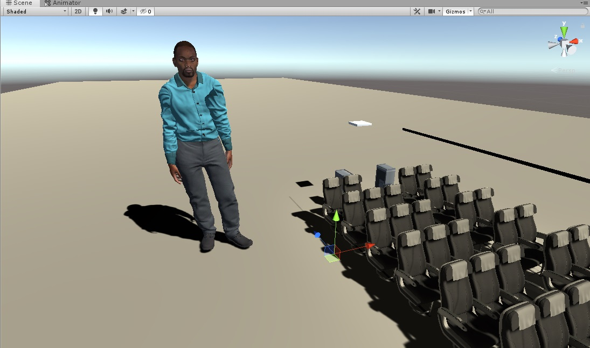
    </td>
    <td>
      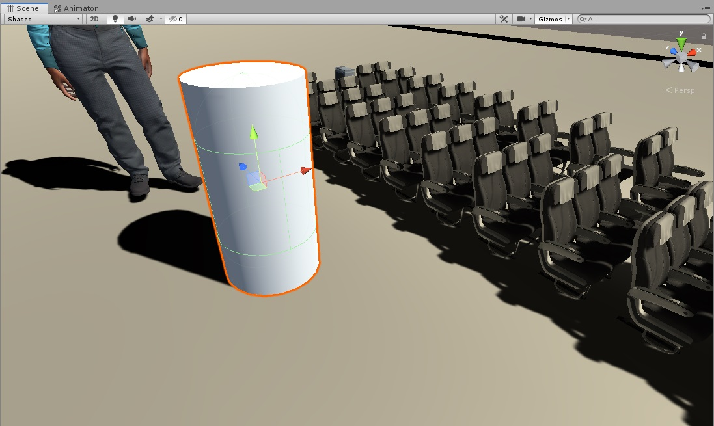
    </td>
    <td>
      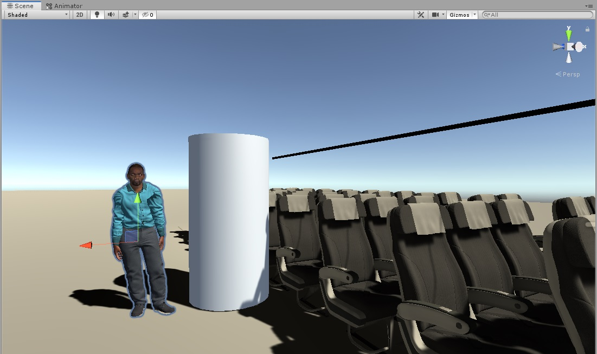
    </td>
  </tr>
</table>

#### Virtual Ground

The Plane Model downloaded consists of detailed delineated game objects. However, due to the principle of reducing size of the model by merging objects of the same entity, the entire hull of cabin is one object that makes it not possible to generate mesh on top of that. 

<table>
  <tr>
    <th>The Entire Hull is ONE OBJECT</th>
  </tr>
  <tr>
    <td>
      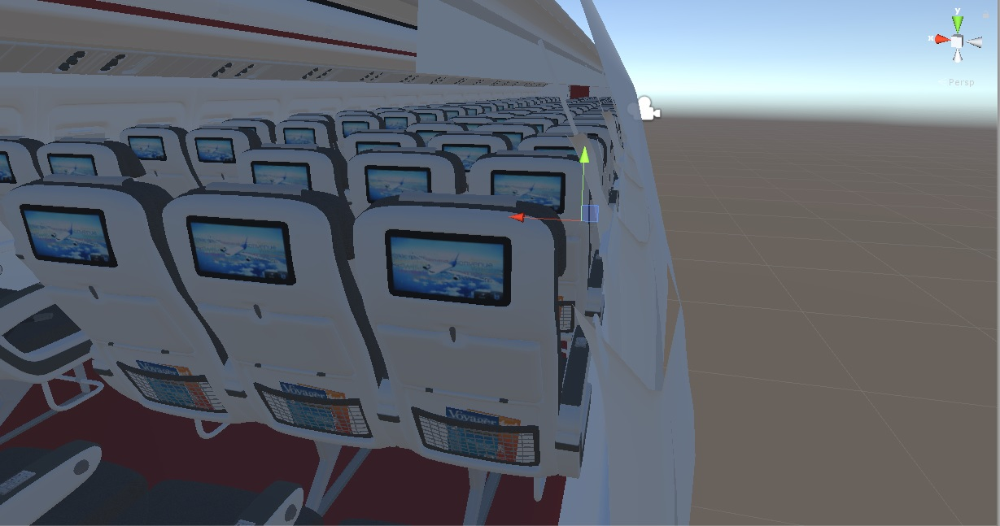
    </td>
  </tr>
</table>

In order to tackle this, a virtual ground has been introduced where a thin Cube has been placed on the floor of the plane:

<table>
  <tr>
    <th>Virtual Ground viewing from outside</th>
    <th>Virtual Ground viewing from inside</th>
    <th>Nav Mesh on Virtual Ground with Seat suppressed</th>
</tr>
  <tr>
    <td>
      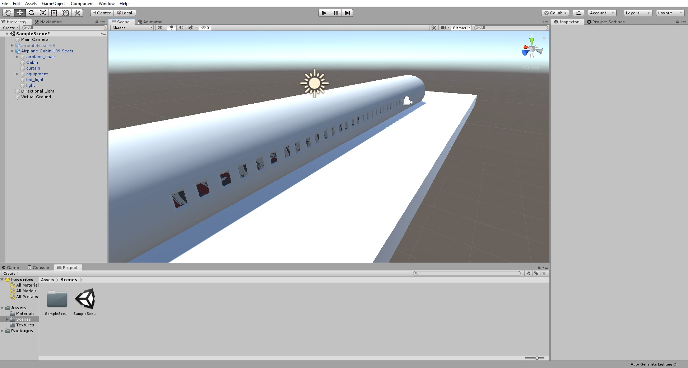
    </td>
    <td>
      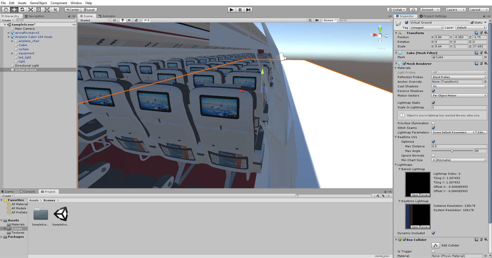
    </td>
    <td>
      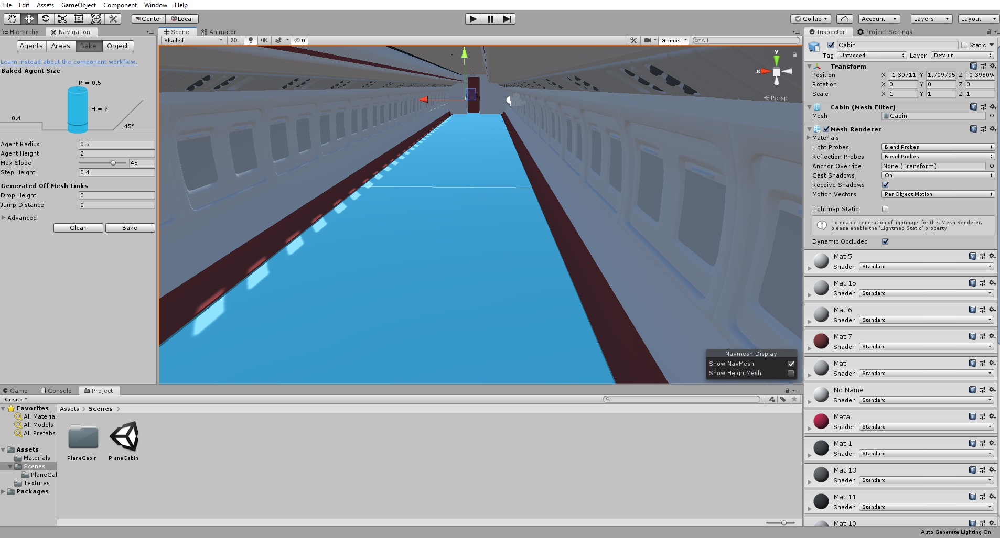
    </td>
  </tr>
</table>

From the third image, you can see how the Nav Mesh looks like if no seats is presenting.

#### Virtual Collider

After tackling the ground problem, another issue aroused that the seats are not regular shape and too close to each other. Due that the seats cannot be easily predigested to simpler geometrical shape that can be interpreted by the program, no nav mesh will be generated between the seats and all nav mesh will be outside the counter of the plane hull.

To tackle this, a virtual collider has been created to replace the collider mesh of the seat:

<table>
  <tr>
    <th>Virtual Cube Collider</th>
    <th>Virtual Cube Collider covering the seat</th>
</tr>
  <tr>
    <td>
      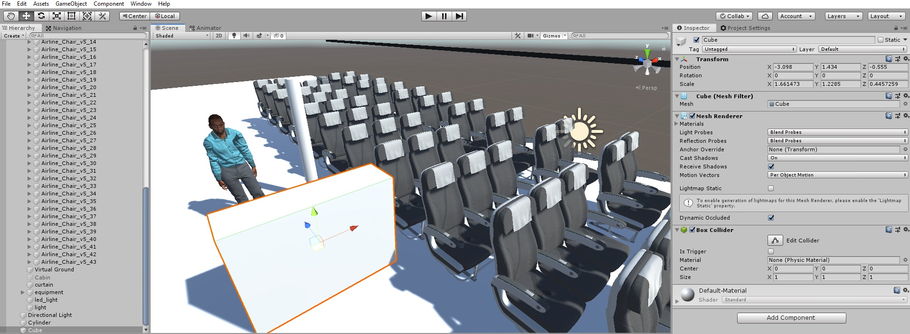
    </td>
    <td>
      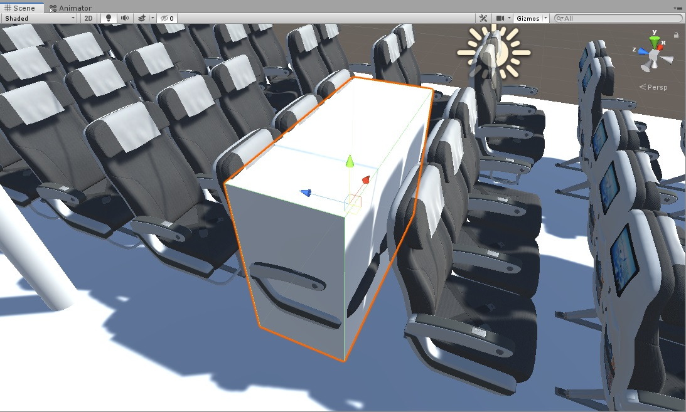
    </td>
  </tr>
</table>

The cube has been adjusted to the relative size of the seat and replace the complex geometry of the seat with simple cube for generating the mesh.

After that, rows of cubes have been created for for all the seats with 0.8m distance to the adjacent one:

<table>
  <tr>
    <th>Creating duplications of the Virtual Collider</th>
    <th>All Virtual Colliders finished</th>
</tr>
  <tr>
    <td>
      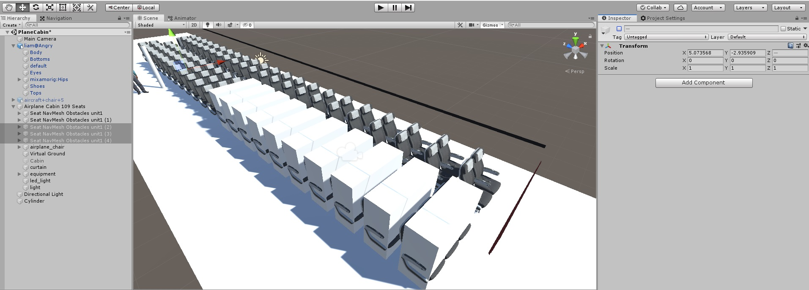
    </td>
    <td>
      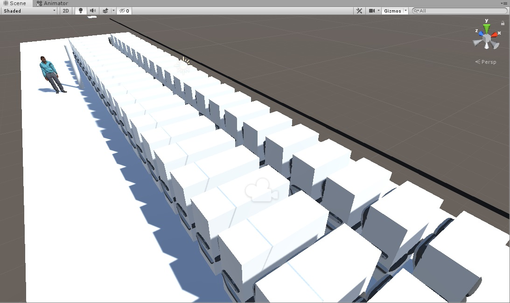
    </td>
  </tr>
</table>

Finally after creating all the virtual cubes, we try to generate the mesh graph upon that.

Due that only static objects are compiled into the navigation graph, without the addition of a local avoidance system for dynamic objects, agents may collide with each other or other dynamic objects. Multiple agents and other dynamic objects also need to be able to happily co-exist

As the navigation graph is compiled at development time, path searches do not take into account objects which can move at run-time.

Therefore, the cube and the seat has been set to `static` with all child ojbects included.

<table>
  <tr>
    <th>Baked Mesh</th>
    <th>Baked Mesh with Cube Mesh suppressed</th>
  </tr>
  <tr>
    <td>
      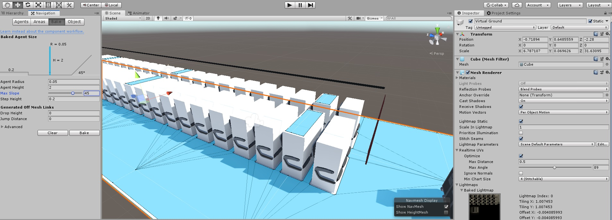
    </td>
    <td>
      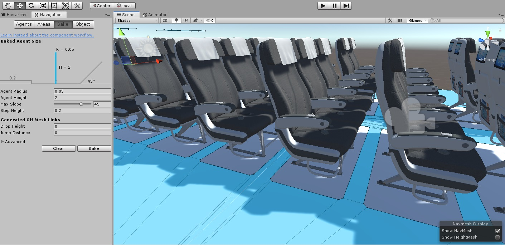
    </td>
  </tr>
</table>

The second image has shown the final effect of the mesh generation on top of the virtual colliders. From the image, we can clearly see a blue region between the seats where the characters can walk.

If we untick all the objects, we can get a diagram of only the mesh for the agent to traverse upon:

<table>
  <tr>
    <th>Only Baked Mesh Presenting</th>
  </tr>
  <tr>
    <td>
      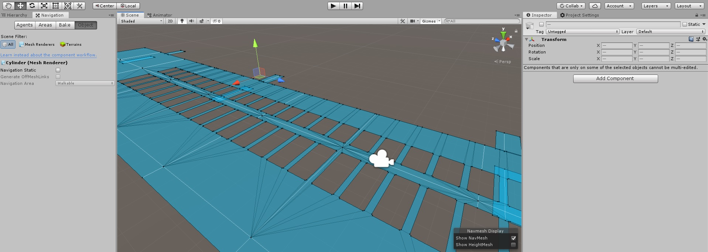
    </td>
  </tr>
</table>

This above diagram shows clearly how the abstracted mesh mapping onto the corridors.

<br />

### Waypoints

#### Setting Up Waypoints

To set up way points go to the 'GameObject' menu and select 'Create Empty'. This creates an empty game object, rename it to 'Waypoints'. It is advisable to immediately position this object at `0,0,0`. This can be done in the inspector.

To create the first waypoint, add a child game object by selecting 'Create Empty Child' from the 'Game Object' menu when the 'Waypoints' object is selected. Rename to 'Waypoint 1'. 

To add a graphic for the system to render for the way point, find a simple flag png and add to project. With the child object selected, in the inspector pane click the cube icon in the top left corner of the menu. Hit 'Other' in the menu that appears and find your png. To create more, right click and use 'Duplicate'.

> tip: if place end waypoint into a solid object, no path can be found

> tip: **ALWAYS RESET THE PARENT OBJECTS COORDINATION!!!**

> tip: `ctrl` + `shift` + mouse drag: snap stuff to the surface immediately beneath it

<table>
  <tr>
    <th>Setting up the Waypoints</th>
  </tr>
  <tr>
    <td>
      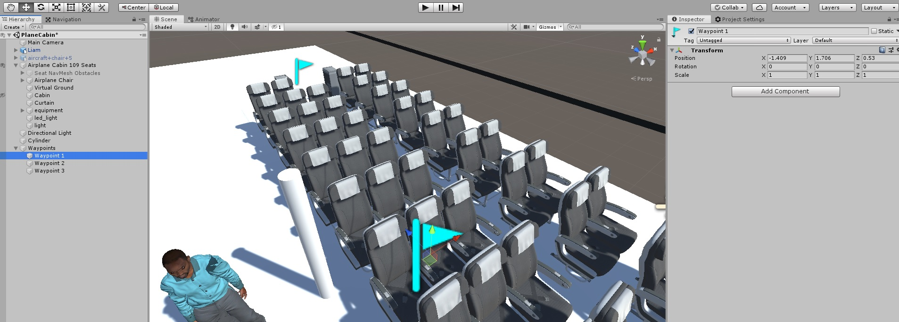
    </td>
  </tr>
</table>

Another two waypoints have been put at the position of washroom in the back and washroom in the front.

<table>
  <tr>
    <th>Waypoint at the back of the Cabin</th>
    <th>Waypoint at the front of the Cabin, behind the curtain</th>
</tr>
  <tr>
    <td>
      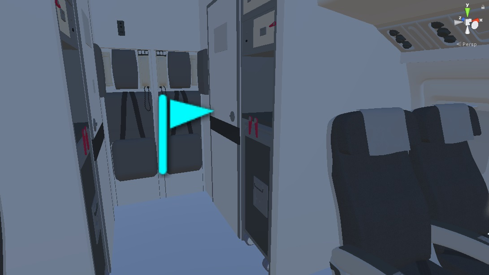
    </td>
    <td>
      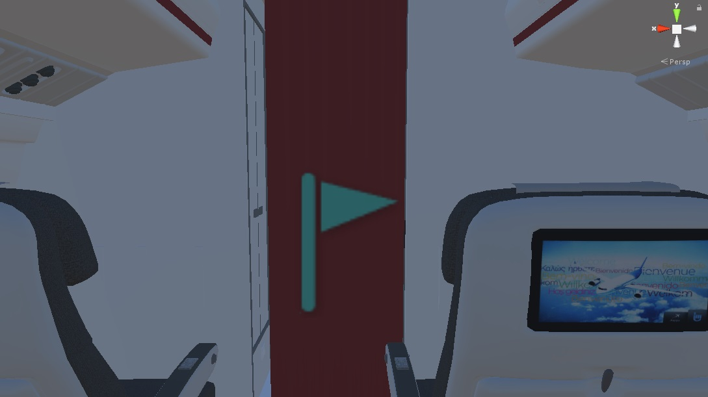
    </td>
  </tr>
</table>

To create a waypoint network, create a new game object using 'Create Empty'. Create a C# script called 'AIWaypointsNetwork.cs' and add it to the network object.

Edit the script to contain a list of transform objects:

<!--- >  **Warning: the dropdown code session below is not very obvious. Please pay attention to all the "CLICK ME TO VIEW CODE" signs** --->

> ```diff
> -Warning: the dropdown code session below is not very obvious. 
> -Please pay attention to all the "CLICK ME TO VIEW CODE" signs
> ```

<details><summary>CLICK ME TO VIEW CODE</summary>
<p>

```c#
using System.Collections;
using System.Collections.Generic;
using UnityEngine;

// Display Mode that the Custom Inspector of an AIWaypointNetwork component can be in
public enum PathDisplayMode {
    None,
    Connections,
    Paths
}


// ==================================================================================
// CLASS : AIWaypointNetwork
// DESC  : Contains a list of waypoints. Each waypoint is a reference to a transform.
//         Also contains settings for the Custom Inspector
// ==================================================================================
public class AIWaypointNetwork : MonoBehaviour {
    // Current Display Mode
    // Stop the editor from showing the fields as they have been shown in the editor script
    public PathDisplayMode DisplayMode = PathDisplayMode.Connections;

    [HideInInspector] public int UIStart = 0; // Start wayopoint index for Paths mode
    [HideInInspector] public int UIEnd   = 0; // End waypoint index for Paths mode

    public List<Transform> Waypoints = new List<Transform>();
}
```

</p>
</details>

#### Link the waypoints in the networks

In order to get unity to render our waypoint paths we must create an editor script which modifies the way the unity editor renders components. An editor script is a C# script that MUST be within a folder named 'Editor'. It does not matter where this folder is in the hierarchy, in fact you can have multiple. Unity treats each as one single folder. 

<details><summary>CLICK ME TO VIEW CODE</summary>
<p>

```c#
using System.Collections;
using System.Collections.Generic;
using UnityEditor;
using UnityEngine;
using UnityEngine.AI;

// ===========================================================================================
// CLASS : AIWaypointNetworkEditor
// DESC  : Custom Inspector and Scene View Rendering for the AIWaypointNetwork  Component
// ===========================================================================================

// using attribute to let Unity know to use this script when displaying AI waypoint network
[CustomEditor(typeof(AIWaypointNetwork))]
public class AIWaypointNetworkEditor : Editor {
    // --------------------------------------------------------------------------------
    // METHOD :  OnInspectorGUI (Override)
    // Desc    :  Called by Unity Editor when the Inspector needs repainting for an
    //      AIWaypointNetwork Component
    // --------------------------------------------------------------------------------
    public override void OnInspectorGUI() {
        // Get reference to selected component
        AIWaypointNetwork network = (AIWaypointNetwork) target;

        // Show the Display Mode Enumeration Selector
        // will trigger error if not cast back to <PathDisplayMode>
        network.DisplayMode = (PathDisplayMode) EditorGUILayout.EnumPopup("Display Mode", network.DisplayMode);

        // If we are in Paths display mode then display the integer sliders for the Start and End waypoint indices
        // If in other mode, the slider will disappear
        if (network.DisplayMode == PathDisplayMode.Paths) {
            network.UIStart = EditorGUILayout.IntSlider(
                "Waypoint Start",
                network.UIStart,
                0,
                network.Waypoints.Count - 1);
            network.UIEnd = EditorGUILayout.IntSlider(
                "Waypoint End",
                network.UIEnd,
                0,
                network.Waypoints.Count - 1);
        }

        // Tell Unity to do its default drawing of all serialized members that are NOT hidden in the inspector
        DrawDefaultInspector();
    }

    // ---------------------------------------------------------------------------------------------
    // METHOD : OnSceneGUI
    // DESC   : Implementing this functions means the Unity Editor will call it when the Scene View
    //          is being repainted. This gives us a hook to do our own rendering to the scene view.
    // ---------------------------------------------------------------------------------------------

    // suppose to be intended to override that behaviour of any waypoint network component
    void OnSceneGUI() {
        AIWaypointNetwork network = (AIWaypointNetwork) target;

        // loop through all the waypoints in the network
        for (int i = 0; i < network.Waypoints.Count; i++) {
            if (network.Waypoints[i] != null) {
                Handles.Label(network.Waypoints[i].position, "Waypoint " + i.ToString());
            }
        }

        // --------------------------------------------------
        // Display in Connection of Path in Inspector
        // --------------------------------------------------

        if (network.DisplayMode == PathDisplayMode.Connections) {
            /* ---------- Connection Mode: connection all points using polylines ---------- */

            // Allocate array of vector to store the polyline positions
            Vector3[] linePoints = new Vector3[network.Waypoints.Count + 1];

            // Loop through each waypoint + one additional interaction
            for (int i = 0; i <= network.Waypoints.Count; i++) {
                // Calculate the waypoint index with wrap-around in the last loop iteration
                int index = i != network.Waypoints.Count ? i : 0;

                // Fetch the position of the waypoint for this iteration and copy into our vector array.
                if (network.Waypoints[index] != null) {
                    linePoints[i] = network.Waypoints[index].position;
                } else {
                    linePoints[i] = new Vector3(Mathf.Infinity, Mathf.Infinity, Mathf.Infinity);
                }
            }

            // Set the Handle color to Cyan to let the line stands out
            Handles.color = Color.cyan;

            // Render the polyline in the scene view by passing in our list of waypoint positions
            Handles.DrawPolyLine(linePoints);
        } else if (network.DisplayMode == PathDisplayMode.Paths) {
            /* ---------- Path Mode: proper nav-mesh path search and render result ---------- */

            // Allocate a new NavMeshPath
            NavMeshPath path = new NavMeshPath();

            // Assuming both the start and end waypoint indices selected are legit
            if (network.Waypoints[network.UIStart] != null && network.Waypoints[network.UIEnd] != null) {
                // Fetch their positions from the waypoint network
                Vector3 from = network.Waypoints[network.UIStart].position;
                Vector3 to   = network.Waypoints[network.UIEnd].position;

                // Request a path search on the nav mesh. This will return the path between from and to vectors
                NavMesh.CalculatePath(from, to, NavMesh.AllAreas, path);

                // Set Handles color to Yellow
                Handles.color = Color.yellow;

                // Draw a polyline passing int he path's corner points
                Handles.DrawPolyLine(path.corners);
            }
        }
    }
}
```

</p>
</details>

After implementing the editor, we can now manipulate the waypoint paths with the shortest path on the Nav Mesh Agent has been generated. By setting the `UIStart` and `UIEnd`, we can see the shortest path between two waypoints.

<table>
  <tr>
    <th>Shortest Path between the seat and the back washroom</th>
  </tr>
  <tr>
    <td>
      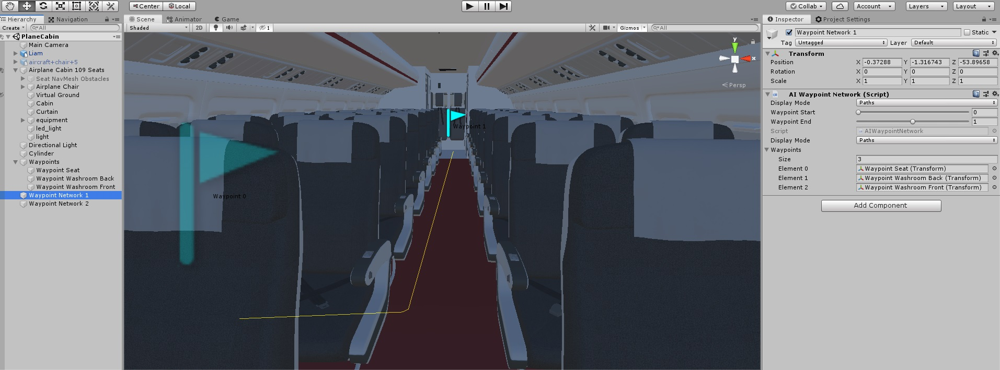
    </td>
  </tr>
</table>

<table>
  <tr>
    <th>Shortest Path between the back washroom and the front washroom</th>
  </tr>
  <tr>
    <td>
      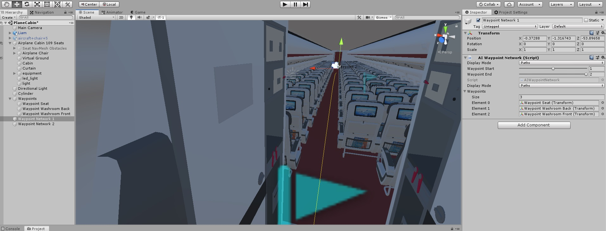
    </td>
  </tr>
</table>

<table>
  <tr>
    <th>Shortest Path between the front washroom and the seat</th>
  </tr>
  <tr>
    <td>
      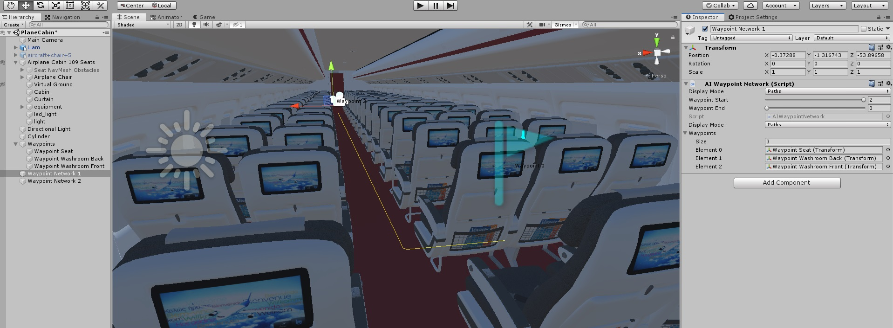
    </td>
  </tr>
</table>

Therefore the logic here is that, as long as a character, either the user of the NPC whats to go to the washroom, the path will automatic generates to let the agent traverse to the closet washroom first, if there is a queue, then the agent will traverse to the other washroom. After finishing going to the washroom, the agent will go back to the seat.

> The above logic of find the washroom with least queue will be implemented future sessions upon the shortest path generated from the waypoints on the nav mesh.

<br />

### Nav Agent

The cylinder previously added to the scene has been now used to represent a basic user agent. . A nav-mesh component is then added to the inspector to create movement parameters.

A new class, NavAgentExample.cs is then created. This class controls selection and of new way points and initiates movement. This class relies on the '[hasPath](https://docs.unity3d.com/412/Documentation/ScriptReference/NavMeshAgent-hasPath.html)' method. This method is a-synchronous. In other words, when a destination is set it takes some time for the path to be computed. The hasPath method returns true when complete. This method can be used in conjunction with the 'pathPending' method to build robust logic. A check can be added against the nav agent's parameter [pathStatus](https://docs.unity3d.com/530/Documentation/ScriptReference/NavMeshPathStatus.html) to determine if the path is complete, partial or invalid.

<details><summary>CLICK ME TO VIEW CODE</summary>
<p>

```c#
using System.Collections;
using System.Collections.Generic;
using UnityEngine;
using UnityEngine.AI;

// the attribute here will automatically bring a Nav Mesh Agent when attached to an object
[RequireComponent(typeof(NavMeshAgent))]
public class NavAgentExample : MonoBehaviour {
    // Inspector Assigned Variable
    public AIWaypointNetwork WaypointNetwork = null;

    public int  CurrentIndex = 0;
    public bool HasPath      = false;
    public bool PathPending  = false;
    public bool PathStale    = false;

    public NavMeshPathStatus PathStatus = NavMeshPathStatus.PathInvalid;

    // Jump Curve used for later off mesh link manipulations
    public AnimationCurve JumpCurve = new AnimationCurve();

    // Private Members (cache reference to it later)
    private NavMeshAgent _navAgent = null;

    // Use this for initialization
    void Start() {
        // Cache NavMeshAgent Reference
        _navAgent = GetComponent<NavMeshAgent>();

        // This section for fun
        // Turning off auto-update, then only the cylinder is moving
        // while the mesh is not updating
        //_navAgent.updatePosition = false;
        //_navAgent.updateRotation = false;

        // If not valid Waypoint Network has been assigned then return
        if (WaypointNetwork == null) return;

        // prototyping to test the navigation works
        //if (WaypointNetwork.Waypoints[CurrentIndex] != null) {
        //  // due that `Waypoints` is a transform, we fetch the position of that
        //  _navAgent.destination = WaypointNetwork.Waypoints[CurrentIndex].position;
        //}

        SetNextDestination(false);
    }

    // Update is called once per frame
    void Update() {
        // Copy NavMeshAgents state into inspector visible variables
        HasPath     = _navAgent.hasPath;
        PathPending = _navAgent.pathPending;
        PathStale   = _navAgent.isPathStale;
        PathStatus  = _navAgent.pathStatus;


        // If agent is on an offmesh link then perform a jump
        if (_navAgent.isOnOffMeshLink) {
            StartCoroutine(Jump(1.0f));
            return;
        }

        // If we don't have a path and one isn't pending then set the next waypoint as the target,
        // otherwise if path is stale regenerate path
        // when encountering partial path, reach the closet viable position and reject the waypoint and find a new path
        // if uncomment the last or statement, will completely ignore the partial path
        // _navAgent.stoppingDistance for judging the threshold of jumping
        // stoppingDistance property is in nav mesh agent inspector, representing the distance away from the destination considering traversed
        if ((_navAgent.remainingDistance <= _navAgent.stoppingDistance && !PathPending) ||
            PathStatus == NavMeshPathStatus.PathInvalid /*|| 
      PathStatus == NavMeshPathStatus.PathPartial*/) {
            SetNextDestination(true);
        } else if (_navAgent.isPathStale) {
            // check whether the path is stale, meaning no longer valid or optimal
            // current index won't be incremented
            // reset the same waypoint and regenerate a path for the current waypoint
            SetNextDestination(false);
        }
    }

    void SetNextDestination(bool increment) {
        // If no network return
        if (!WaypointNetwork) return;

        // Calculate how much the current waypoint index needs to be incremented
        int       incStep               = increment ? 1 : 0;
        Transform nextWaypointTransform = null;

        int nextWaypoint = (CurrentIndex + incStep >= WaypointNetwork.Waypoints.Count) ? 0 : CurrentIndex + incStep;
        nextWaypointTransform = WaypointNetwork.Waypoints[nextWaypoint];

        // Assuming we have a valid waypoint transform
        if (nextWaypointTransform != null) {
            // Update the current waypoint index, assign its position as the NavMeshAgents Destination and then return
            CurrentIndex          = nextWaypoint;
            _navAgent.destination = nextWaypointTransform.position;
            return;
        }

        // We did not find a valid waypoint in the list for this iteration
        // In the next iteration of the loop, having another pop up
        CurrentIndex++;
    }

    // --------------------------------------------------------------------------------------
    // Name  : Jump
    // Desc  : Manual OffMeshLInk traversal using an Animation Curve to control agent height.
    // --------------------------------------------------------------------------------------
    IEnumerator Jump(float duration) {
        // create a loop that interpolate between the positions of agents currently at the end point of the off link 

        // Get the current OffMeshLink data
        OffMeshLinkData data = _navAgent.currentOffMeshLinkData;

        // Start Position is agent current position rather the start position property of the nav mesh link
        Vector3 startPos = _navAgent.transform.position;

        // End position is fetched from OffMeshLink data and adjusted for base-offset of agent
        Vector3 endPos = data.endPos + (_navAgent.baseOffset * Vector3.up);

        // Used to keep track of time
        float time = 0.0f; // set to 0 to begin with, modified later


        // Keeo iterating for the passed duration
        while (time <= duration) {
            // Calculate normalized time
            float t = time / duration;

            // Lerp between start position and end position and adjust height based on evaluation of t on Jump Curve
            // Lerp: Linearly interpolates between two vectors.
            _navAgent.transform.position = Vector3.Lerp(startPos, endPos, t) + (JumpCurve.Evaluate(t) * Vector3.up);

            // Accumulate time and yield each frame
            // make sure yield from the coroutine because we wish to only yield for a single frame
            // and then have another iteration of the while loop executed next frame
            time += Time.deltaTime;
            yield return null;
        }

        // All done so inform the agent it can resume control to next target
        _navAgent.CompleteOffMeshLink();
    }
}
```

</p>
</details>

Now the nav agent will automatically traverse through the waypoints(currently following the order of seat to back washroom, then to front wash room):

<table>
  <tr>
    <th>Nav Agent Path Traverse</th>
  </tr>
  <tr>
    <td>
      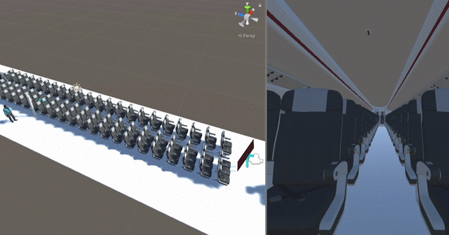
    </td>
  </tr>
</table>

<br />

### Off-Mesh Links

Partial paths occur when a waypoint is not reachable. The agent will get as close as possible then declare that it has completed that path, and then move on. In order to make move the agent between disjoint parts of the nav mesh, off-mesh links have to be created.

Off-mesh links can be generated in the nav-mesh by setting a jump distance greater than 0. Any gaps less than this will become traversable. [There is a bug in Unity](https://issuetracker.unity3d.com/issues/navmeshagent-dot-haspath-is-false-when-agent-is-crossing-an-offmeshlink) where the 'hasPath' Boolean is set to false immediately after traversing an off-mesh link. This can break correct logic. It can be circumvented by using the [remainingDistance](https://docs.unity3d.com/ScriptReference/AI.NavMeshAgent-remainingDistance.html) method in conjunction with the stopping distance of the agent (please see the script above):

```c#
_navAgent.remainingDistance <= _navAgent.stoppingDistance
```

> Retrospect to the theory above for the theory of **Unity Path Corridor**: A path search in Unity returns to the agent a Corridor is a list of polygons that must be traversed. Polygons represents area Corridors are useful for supplying the agent with surrounding information so run-time path diversions can be safely computed/ It is actually the vertices of the corridor that form the way-point list the agent must pass through

> In order to investigate the nuts and bolts of navigation mesh generation: **www.critterai.org** (GET DIAGRAM FROM THIS WEB!!!)
>
> 
> 
>
> **build in such a way that we cater for the ability to have those disjoint polygons in the nav mesh, so that we can create off mesh links between them**
>
> **also build in such a way that supports multi-leveled overlapping nav mesh, so that we could generate enough mesh for a block of flats**
>
> When Regions have been created we avoid those regions up into convex polygons and store the result as a graph and as a nav mesh
> 
> 
> 
>
> nav mesh won't be changed by the inclusion of the mesh collider of the entire scene

**To create a manual off-mesh link:**
1. Create two empty game objects (not children), give names (ex: entrance, exit).
2. Place over the gap you wish the link.
3. On one of the game objects add the 'Off-mesh link' component.
4. Drag that objects transform component (also in the inspector) into the start/end parameter of the 'Off-mesh link' component.
5. Drag the other game object into the remaining start/end parameter.5. 

**To Customize the traversal of off-mesh links:**
1. In the agent, turn off 'Auto-traverse off mesh links'.
2. In the agent's update detect [isOnOffMeshLink](https://docs.unity3d.com/ScriptReference/AI.NavMeshAgent-isOnOffMeshLink.html).
3. Call a [CoRoutine](https://docs.unity3d.com/Manual/Coroutines.html). (A CoRoutine is a method which can run over multiple update calls).
4. Create an 'AnimationCurve' objct as a member of the update script.
5. Add an evaluation of the AnimationCurve to a lerp of the start->end of the traversal (see example below).
6. In the Unity Editor, on the nav agent's update script modify the `AnimationCurve` object to a desired cuve (ex. parabola)

```c#
_navAgent.transform.position = Vector3.Lerp(startPos, endPos, t) + JumpCurve.Evaluate(t) * Vector3.up;
```

> Mind that: when two unlinked mesh not same altitude, no longer referred to jump distance scenario but more of drop height scenario.

---

<br />

Now we have finished the navigation mesh part of the development. Before going straight into tackling the animation part of the development, Let's attach an ghost free roam camera spec onto the current main camera which provides more flexibility for navigating through the scene in Game Play mode.

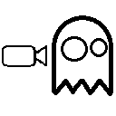

- Attach the `GhostFreeRoamCamera` script to the camera and rename it `GhostFreeRoamCamera`
- Create an empty object and name it `GUIHelper`, attach the `GUIHelper.cs` script onto it.

<details><summary>CLICK ME TO VIEW CODE</summary>
<p>

```c#
using UnityEngine;

[RequireComponent(typeof(Camera))]
public class GhostFreeRoamCamera : MonoBehaviour {
    public float initialSpeed  = 3.5f;
    public float increaseSpeed = 1.25f;

    public bool allowMovement = true;
    public bool allowRotation = true;

    public KeyCode forwardButton  = KeyCode.W;
    public KeyCode backwardButton = KeyCode.S;
    public KeyCode rightButton    = KeyCode.D;
    public KeyCode leftButton     = KeyCode.A;

    public float   cursorSensitivity   = 0.0125f;
    public bool    cursorToggleAllowed = true;
    public KeyCode cursorToggleButton  = KeyCode.Escape;

    private float currentSpeed  = 0f;
    private bool  moving        = false;
    private bool  togglePressed = false;

    private void OnEnable() {
        if (cursorToggleAllowed) {
            Screen.lockCursor = true;
            Cursor.visible    = false;
        }
    }

    private void Update() {
        if (allowMovement) {
            bool    lastMoving    = moving;
            Vector3 deltaPosition = Vector3.zero;

            if (moving) {
                currentSpeed += increaseSpeed * Time.deltaTime;
            }

            moving = false;

            CheckMove(forwardButton,  ref deltaPosition, transform.forward);
            CheckMove(backwardButton, ref deltaPosition, -transform.forward);
            CheckMove(rightButton,    ref deltaPosition, transform.right);
            CheckMove(leftButton,     ref deltaPosition, -transform.right);

            if (moving) {
                if (moving != lastMoving) {
                    currentSpeed = initialSpeed;
                }

                transform.position += deltaPosition * currentSpeed * Time.deltaTime;
            } else currentSpeed = 0f;
        }

        if (allowRotation) {
            Vector3 eulerAngles = transform.eulerAngles;
            eulerAngles.x += -Input.GetAxis("Mouse Y") * 359f * cursorSensitivity;
            eulerAngles.y += Input.GetAxis("Mouse X") * 359f  * cursorSensitivity;

            transform.eulerAngles = eulerAngles;
        }

        if (cursorToggleAllowed) {
            if (Input.GetKey(cursorToggleButton)) {
                if (!togglePressed) {
                    togglePressed     = true;
                    Screen.lockCursor = !Screen.lockCursor;
                    Cursor.visible    = !Cursor.visible;
                }
            } else togglePressed = false;
        } else {
            togglePressed  = false;
            Cursor.visible = false;
        }
    }

    private void CheckMove(KeyCode keyCode, ref Vector3 deltaPosition, Vector3 directionVector) {
        if (Input.GetKey(keyCode)) {
            moving        =  true;
            deltaPosition += directionVector;
        }
    }
}
```

</p>
</details>

<details><summary>CLICK ME TO VIEW CODE</summary>
<p>

```c#
using UnityEngine;

public class GUIHelper : MonoBehaviour {
    public Texture icon;

    private void OnGUI() {
        GUI.Box(new Rect(10,         10, 430, 120), "Ghost Free Roam Camera!");
        GUI.DrawTexture(new Rect(20, 20, 32,  32), icon);
        GUI.Label(new Rect(20, 52, 500, 500),
            "Now you can have a free fly camera in your game, or for debugging!\n" +
            "Use the mouse to turn\n"                                              +
            "Use W,A,S,D to move\n"                                                +
            "Use Escape to toggle the cursor (maximize on play in editor)");
    }
}
```

</p>
</details>

Now we can freely navigate in the game scene

<table>
  <tr>
    <th>Ghost Free Roam Camera Navigation</th>
  </tr>
  <tr>
    <td>
      
    </td>
  </tr>
</table>

---

<br />

## Animation State Machine

To create an animation state machine (ASM) an animator controller must be created and assigned to a model's animator component.

Animations can be included in the ASM by dragging them into the animator controller window. By double clicking, the inspector for that animation can be retrieved. Selecting the 'Loop Time' animation will loop the animation when played. This is advisable when controlling via parameters. Transitions can be made by right-clicking the source node and connecting to a destination node. De-selecting 'Has Exit Time' allows for a transition to take place at any time. It does not have to wait for the animation to complete.

#### Mechanim

Mechanim provides a crucial means of mapping (humanoid) animations to models irregardless of the naming convention of the hierarchy. This allows any animation to be mapped to any model. Both an animation and a model are given an 'Avatar' by Unity. The animation and character hierarchies are then mapped to their respective avatars. Since unity avatars are constant unity can pair them to connect any animation with any model. This feature is called 'Humanoid Re-targeting'.

**To make a character model/animation available to mechanim**
1. Select the .fbx file of the character model.
2. Choose the 'Rig' tab in the inspector.
3. Change 'Animation Type' to 'Humanoid'.
4. Change 'Avatar Definition' to 'Create From This Model'.
5. Hit Apply.
6. Should be a small check mark near the 'Configure' button. Signifies that Unity was able to find all of the bones in the hierarchy it expected.
7. Hit 'Configure' if it fails.

**If animation is not working correctly**
Avatar creation requires the skeleton to be in a T-Pose. If not, the animation could look strange. There are two fixes:

1. On the 'Rig' tab, change 'Avatar Definition' to 'Create from Other Avatar'. Find the avatar of the model for which the animation was created.
2. On the 'Rig' tab, hit 'Configure'. Manually adjust the skeleton into a T-Pose.2. 

> tip: setting `Animation Type` to `Generic`: basically informing unity that we don't wish this rig to be interpreted as a humanoid rig, it won't have a humanoid avatar created for it and therefore any animations that have been configured as humanoid therefore have their own humanoid avatars will not play on this rig. 
The only animation that will play is the animation that has the exactly matching rig

> - use humanoid
> - do some minor modifications to avatar configuration to make T-Pose

A first model of pink shirt guy, and animation state of standing idle has been imported:

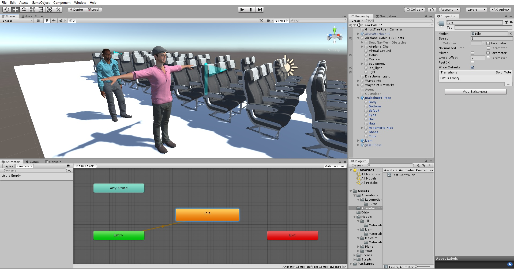

<table>
  <tr>
    <th>Idle State imported for the pink shirt guy</th>
  </tr>
  <tr>
    <td>
      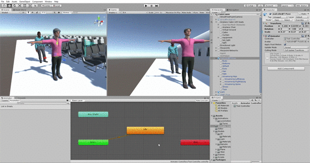
    </td>
  </tr>
</table>

Then we start to tackle the transition from idle state to walking state. We set a new parameter named `isWalking` with type boolean

> - `trigger` vs `boolean`:
>   - `boolean` remains its state
>   - `trigger` reset to `false` after being triggered

<table>
  <tr>
    <th>Animator: Idle / Walk transition</th>
  </tr>
  <tr>
    <td>
      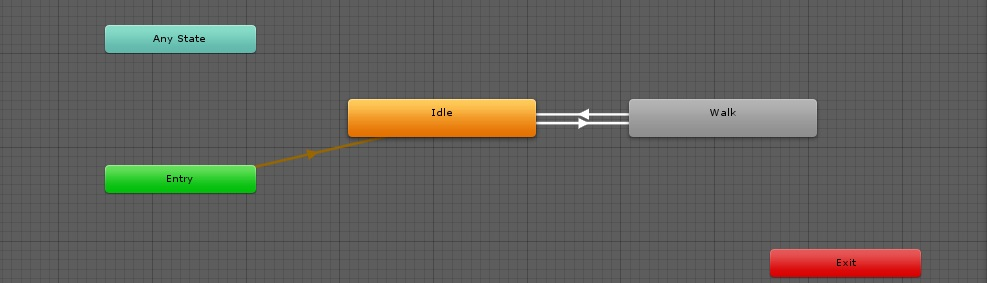
    </td>
  </tr>
</table>

<table>
  <tr>
    <th>Inspector: Idle to Walk transition</th>
    <th>Inspector: Walk to Idle transition</th>
  </tr>
  <tr>
    <td>
      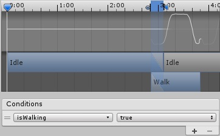
    </td>
    <td>
      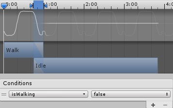
    </td>
  </tr>
</table>

Then I followed the same method and created animation transition for turnings:

<table>
  <tr>
    <th>Animator: Idle / Walk / Turning transitions</th>
  </tr>
  <tr>
    <td>
      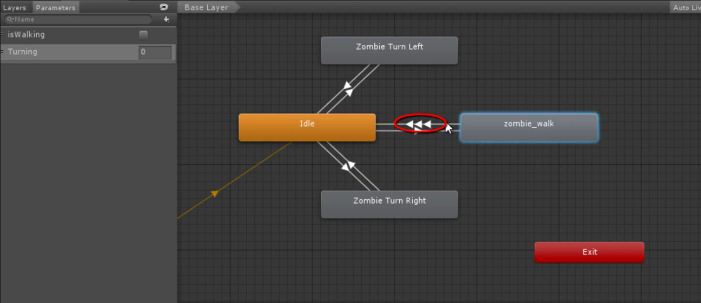
    </td>
  </tr>
</table>

> The effect cannot be shown at this stage since the conditions haven't been met in scripts

After that, I started to investigate the overlapping of motions.

Setting vomiting caused by plane sick as the target scenario, I added a Vomit Layer on top of the Base Layer in the animator. In order to prevent the vomit to overwrite the base layer, I set an `Empty State` as the default state of Vomit Layer thus it can be controlled by our `Vomit` parameter.

> weight assigned to each layer of animation determines the contribution 

After that comes the trick of Avatar Masking. In order to make vomit posture only affecting the upper half of the body thus the other half can be standing, walking or sitting that won't be affected by the vomit layer.   Using the 'Humanoid' drop down the parts of the avatar we do not wish to be affected can be turned off. The mask suppresses all bottom half body features has been made where:

- green area representing the body part that is active in this avatar
- red area representing the body part that is inactive in this avatar

<table>
  <tr>
    <th>Vomit Layer</th>
    <th>Half Body Avatar Mask</th>
  </tr>
  <tr>
    <td>
      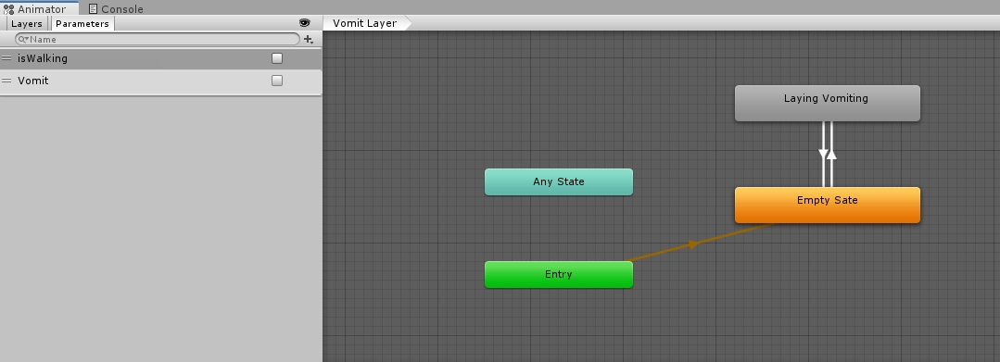
    </td>
    <td>
      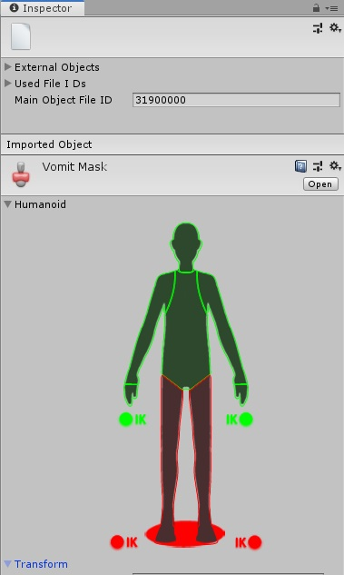
    </td>
  </tr>
</table>

Eventually, the effect of hybrid postures manipulated by several layers animations can be shown:

> Be careful to the cursor in the below GIF, when I clicked `Vomit`, the character starts vomiting while the bottom half body still governed by the Idle animation. When I set `isWalking` to true, the character starts walking while still vomiting.

<table>
  <tr>
    <th>Standing / Walking while Vomiting</th>
  </tr>
  <tr>
    <td>
      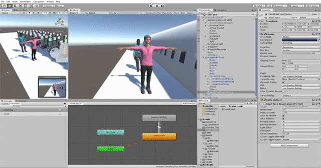
    </td>
  </tr>
</table>

> In future stages when sitting postures have been added in, the animation of an NPC vomiting beside the player will be vividly demonstrated.

After figuring our the overlapping of animations, I start to investigate the way to make the transition of the animations more natural. This involves the intervention of `Locomtion`:

>**Blend Tree**: Allows for a more intelligent means of blending animations (i.e. run, walk, sprint. Based on speed). Blend tree's can have multiple dimensions. For example, speed is a dimension but health can be another. By turning off 'Automate Thresholds' and using 'Compute Thresholds' the animator will look at the root motion of the animations and compute the values of the animations accordingly. Instead of the blend being from 0 to 1 the values will interpolate between the walk speed (1.56) to the run speed (5.66). Now we can plug in the Nav Agent desired speed directly.
>
> Untick automate threshold, tick compute threshold base on speed, the computer will analyse the speed of the moving object and decide which blended motion to use
>
> - 0: full walk
> - 1: full run

> Base on the speed of walking and other parameters together to decide the weight

<table>
  <tr>
    <th>Vomit Layer</th>
    <th>Half Body Avatar Mask</th>
  </tr>
  <tr>
    <td>
      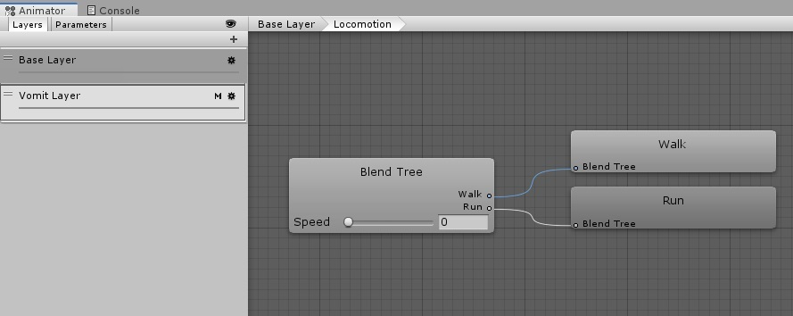
    </td>
    <td>
      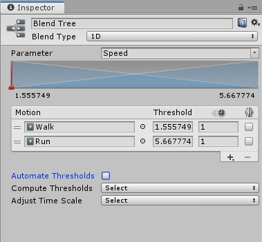
    </td>
  </tr>
</table>

> Via the control of `Locomotion`, the animation from walking to running will transit smoothly. When the speed of the character is in between the speed of running and that of walking, a hybrid animation blended from the two animations will be shown.

For testing the locomotion, a script has been added for controlling camera viewing angle by mounting onto the player's back. Find the head of the desired model and create an empty child of it. Call it 'Head Cam Mount'. Use `GameObject` menu shortcut 'Align with view' to move cam mount to desired position. Add a script `SmoothCameraMount`. Add script to main camera and make the head cam mount the mount object.Change the Update function to LateUpdate and add:

<details><summary>CLICK ME TO VIEW CODE</summary>
<p>

```c#
using System.Collections;
using System.Collections.Generic;
using UnityEngine;

public class SmoothCameraMount : MonoBehaviour {
    public Transform Mount = null;
    public float     Speed = 5.0f;

    void Start() { }

    void LateUpdate() {
        transform.position = Vector3.Lerp(transform.position, Mount.position, Time.deltaTime);
        transform.rotation = Quaternion.Lerp(transform.rotation, Mount.rotation, Time.deltaTime);
    }
}
```

</p>
</details>

Another simple speed controller has also been added:

<details><summary>CLICK ME TO VIEW CODE</summary>
<p>

```c#
using System.Collections;
using System.Collections.Generic;
using UnityEngine;

public class SpeedController : MonoBehaviour {
    public float Speed = 0.0f;

    private Animator _controller = null;

    void Start() {
        _controller = GetComponent<Animator>();
    }

    void Update() {
        _controller.SetFloat("Speed", Speed);
    }
}
```

</p>
</details>

<table>
  <tr>
    <th>Blended Locomotion Demostration (Walking / Running)</th>
  </tr>
  <tr>
    <td>
      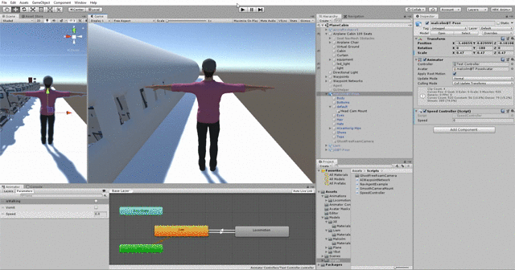
    </td>
  </tr>
</table>

> Pay attention to my cursor dragging the speed tab and how the the animator controller smoothly transit the animation accordingly. 

Finally, after mastering the 1D blend locomotion, for more natural animation in all directions, 2D blend locomotion has been involved.

<table>
  <tr>
    <th>2D Blend Tree Animator Layout</th>
    <th>2D Blend Tree Inspector Layout</th>
  </tr>
  <tr>
    <td>
      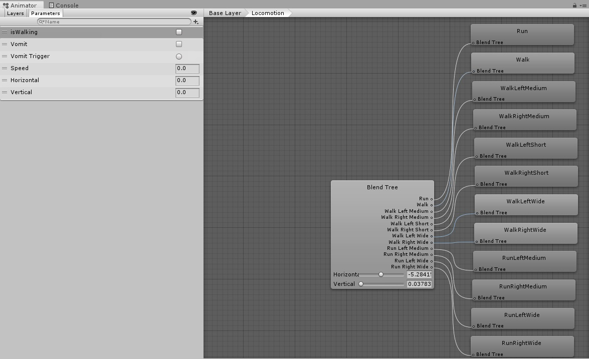
    </td>
    <td>
      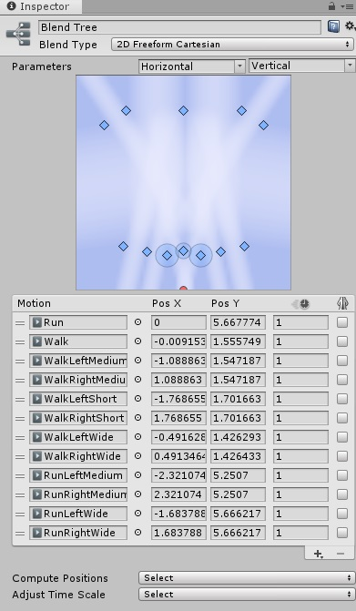
    </td>
  </tr>
</table>

> As you can see in the 2D Blendtree Inspector, the program automatically layout all animations according to there speed and angular velocity, later will compute the position of the animations in the 2D mapping

Then, a script controlling the speed using `w`, `a`, `s`, `d` and mouse for triggering vomitting has been added:

<details><summary>CLICK ME TO VIEW CODE</summary>
<p>

```c#
using System.Collections;
using System.Collections.Generic;
using UnityEngine;

public class Controller : MonoBehaviour {
    private Animator _animator = null;

    // hashes functions for tuning movements in games
    private int _HorizontalHash = 0;
    private int _VerticalHash   = 0;

    private int _vomitHash = 0;

    void Start() {
        _animator       = GetComponent<Animator>();
        _HorizontalHash = Animator.StringToHash("Horizontal");
        _VerticalHash   = Animator.StringToHash("Vertical");
        _vomitHash      = Animator.StringToHash("Vomit Trigger");
    }

    void Update() {
        float xAxis = Input.GetAxis("Horizontal") * 2.32f;
        float yAxis = Input.GetAxis("Vertical")   * 5.66f;

        // use mouse click to control the Player Vomit
        if (Input.GetMouseButtonDown(0)) {
            _animator.SetTrigger(_vomitHash);
        }

        // use up, down, left, right arrows, or wsad keys to control zombie Jill blended movements
        _animator.SetFloat(_HorizontalHash, xAxis, 0.1f, Time.deltaTime);
        _animator.SetFloat(_VerticalHash,   yAxis, 1.0f, Time.deltaTime);
    }
}
```
</p>
</details>

<table>
  <tr>
    <th>2D Blend Tree Inspector Layout Sample Control</th>
  </tr>
  <tr>
    <td>
      
    </td>
  </tr>
</table>

> Please pay attention to the relative position I place the red dot in the 2D blend map and the blinking of the corresponding movements in l.h.s animator which indicating which motion is in control at that moment

<table>
  <tr>
    <th>2D Blend Tree Frontal Demo in Game Player</th>
  </tr>
  <tr>
    <td>
      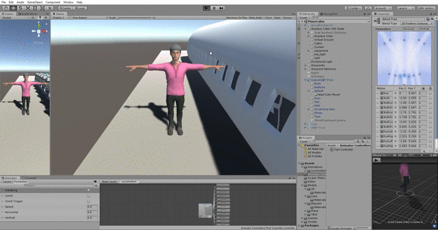
    </td>
  </tr>
</table>

> Please pay attention how the vomiting posture is overlapping onto the character in regardless of his current 2D velocity.

<br />

### Mecanim with Navigation

With the animations all sorted, we finally come to the last tweak of combining the animations and the nav mesh agents. Here we encounter a problem of conflict between animation and navigation due that the animation clips have their own rotation and velocity which will not perfectly fit into the orientation the navigation AI has pointed at.

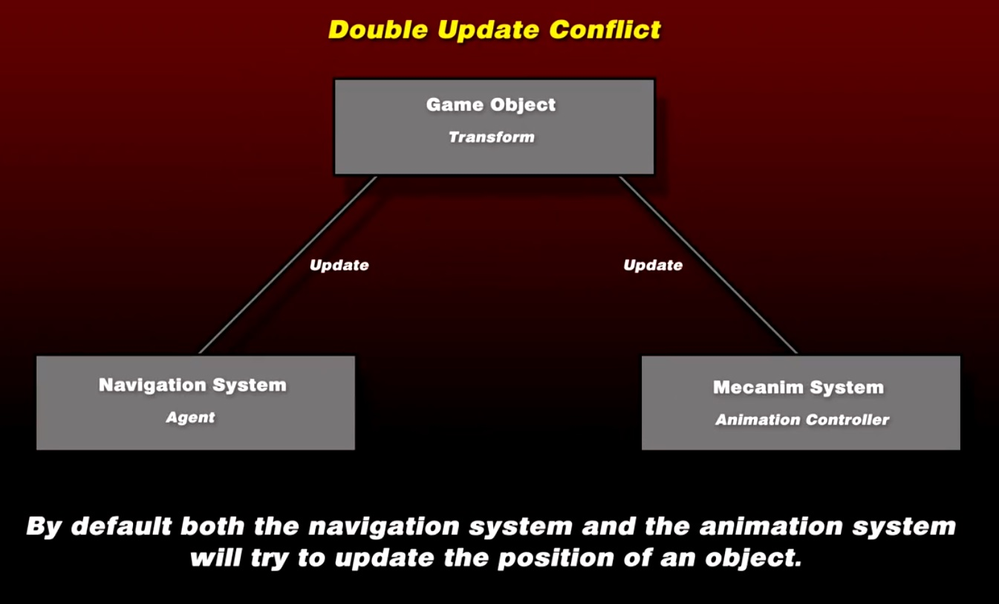

To concordantly coordinate the two systems, we have several ways of approaching, the first being investigated is total control of NavMeshAgent Authority with no root motion applied.

#### NavMeshAgent Authority

- Root Motion disabled on Animator. NO ROOT MOTION --> untick `Apply Root Motion`
- NavMeshAgent automatically updates position and rotation of Transform
- Current Speed and Turn Rate of NavMeshAgent is computed and passed to the Animator as parameters. These are used to find the correct animation blend that most closely matches.
- Foot Sliding will often be very noticeable :(
- Navigation will be at its most accurate

> when the agent is traversing the level, normally it doesn't slow down a lot when it takes shallow corners

<table>
  <tr>
    <th>No Root Motion applied, total control of Nav Agent</th>
  </tr>
  <tr>
    <td>
      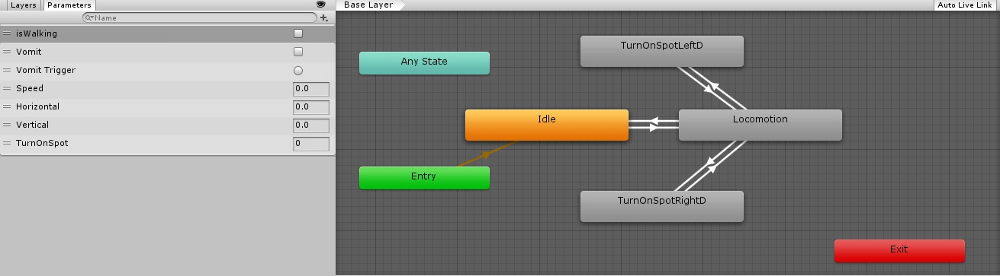
    </td>
  </tr>
</table>

With the following transition settings:

- `Idle` to `Locomotion`:
  - Forward: `Vertical` > 0.1
  - Backward: `Vertical` < 0.1
- `Locomotion` to `TurnOnSpotLeftD`:
  - Forward: `TurnOnSpot` = -1
  - Backward: `TurnOnSpot` > -1
- `Locomotion` to `TurnOnSpotRightD`:
  - Forward: `TurnOnSpot` = 1
  - Backward: `TurnOnSpot` < 1

> **Be very careful to untick the `Has Exit Time` which will cause the agent to hover inside a dead end for millennium due that the walking state has inertia preventing the agent entering turning on spot state**

The `NavAgentNoRootMotion.cs` file has been attached below:

<details><summary>CLICK ME TO VIEW CODE</summary>
<p>

```c#
using System.Collections;
using System.Collections.Generic;
using UnityEngine;
using UnityEngine.AI;

// the attribute here will automatically bring a Nav Mesh Agent when attached to an object
[RequireComponent(typeof(NavMeshAgent))]
public class NavAgentNoRootMotion : MonoBehaviour {
    // Inspector Assigned Variable
    public AIWaypointNetwork WaypointNetwork = null;

    public int  CurrentIndex = 0;
    public bool HasPath      = false;
    public bool PathPending  = false;
    public bool PathStale    = false;

    public NavMeshPathStatus PathStatus = NavMeshPathStatus.PathInvalid;

    // Jump Curve used for later off mesh link manipulations
    public AnimationCurve JumpCurve = new AnimationCurve();

    // Private Members (cache reference to it later)
    private NavMeshAgent _navAgent         = null;
    private Animator     _animator         = null;
    private float        _originalMaxSpeed = 0;

    // Use this for initialization
    void Start() {
        // Cache NavMeshAgent Reference
        _navAgent = GetComponent<NavMeshAgent>();
        _animator = GetComponent<Animator>();

        if (_navAgent) {
            _originalMaxSpeed = _navAgent.speed;
        }

        // This section for fun
        // Turning off auto-update, then only the cylinder is moving
        // while the mesh is not updating
        //_navAgent.updatePosition = false;
        //_navAgent.updateRotation = false;

        // If not valid Waypoint Network has been assigned then return
        if (WaypointNetwork == null) return;

        // prototyping to test the navigation works
        //if (WaypointNetwork.Waypoints[CurrentIndex] != null) {
        //  // due that `Waypoints` is a transform, we fetch the position of that
        //  _navAgent.destination = WaypointNetwork.Waypoints[CurrentIndex].position;
        //}

        SetNextDestination(false);
    }

    // Update is called once per frame
    void Update() {
        // 
        int turnOnSpot;

        // Copy NavMeshAgents state into inspector visible variables
        HasPath     = _navAgent.hasPath;
        PathPending = _navAgent.pathPending;
        PathStale   = _navAgent.isPathStale;
        PathStatus  = _navAgent.pathStatus;

        // Perform cross product on forward vector and desired velocity vector. If both inputs are Unit length,
        // the resulting vector's magnitude will be Sin(theta) where theta is the angle between the vectors.
        Vector3 cross = Vector3.Cross(transform.forward, _navAgent.desiredVelocity.normalized); // unit vector

        // If y component is negative it is a negative rotation else a positive rotation
        float horizontal = (cross.y < 0) ? -cross.magnitude : cross.magnitude;

        // Scale into the 2.32 range for our animator
        horizontal = Mathf.Clamp(horizontal * 2.32f, -2.32f, 2.32f);

        // when the agent is traversing the level, normally it doesn't slow down a lot when it takes shallow corners
        // If we have slowed down and the angle between forward vector and desired vector is greater than 10 degrees
        // the second condition check whether the agent enters slow stepping and prevent that from happening,
        // only when the agent is turning more than 10 degree, its speed will be slowed down
        if (_navAgent.desiredVelocity.magnitude < 1.0f &&
            Vector3.Angle(transform.forward, _navAgent.steeringTarget - transform.position) > 10.0f) {
            // Stop the nav agent (approx) and assign either -1 or +1 to turnOnSpot based on checking sign on `horizontal`
            _navAgent.speed = 0.1f;
            turnOnSpot      = (int) Mathf.Sign(horizontal); // (int) cast float to int
        } else {
            // Otherwise it is a small angle so set Agent's speed to normal and reset turnOnSpot
            _navAgent.speed = _originalMaxSpeed;
            turnOnSpot      = 0;
        }

        // Send the data calculated above into the animator parameters
        _animator.SetFloat("Horizontal", horizontal,                          0.1f, Time.deltaTime);
        _animator.SetFloat("Vertical",   _navAgent.desiredVelocity.magnitude, 0.1f, Time.deltaTime);
        _animator.SetInteger("TurnOnSpot", turnOnSpot);

        /* ---------- Navigation Session ---------- */

        // If agent is on an offmesh link then perform a jump
        //if (_navAgent.isOnOffMeshLink) {
        //  StartCoroutine(Jump(1.0f));
        //  return;
        //}

        // If we don't have a path and one isn't pending then set the next waypoint as the target,
        // otherwise if path is stale regenerate path
        // when encountering partial path, reach the closet viable position and reject the waypoint and find a new path
        // if uncomment the last or statement, will completely ignore the partial path
        // _navAgent.stoppingDistance for judging the threshold of jumping
        // stoppingDistance property is in nav mesh agent inspector, representing the distance away from the destination considering traversed
        if ((_navAgent.remainingDistance <= _navAgent.stoppingDistance && !PathPending) ||
            PathStatus == NavMeshPathStatus.PathInvalid /*|| 
      PathStatus == NavMeshPathStatus.PathPartial*/) {
            SetNextDestination(true);
        } else if (_navAgent.isPathStale) {
            // check whether the path is stale, meaning no longer valid or optimal
            // current index won't be incremented
            // reset the same waypoint and regenerate a path for the current waypoint
            SetNextDestination(false);
        }
    }

    void SetNextDestination(bool increment) {
        // If no network return
        if (!WaypointNetwork) return;

        // Calculate how much the current waypoint index needs to be incremented
        int incStep = increment ? 1 : 0;

        Transform nextWaypointTransform = null;

        int nextWaypoint = (CurrentIndex + incStep >= WaypointNetwork.Waypoints.Count) ? 0 : CurrentIndex + incStep;
        nextWaypointTransform = WaypointNetwork.Waypoints[nextWaypoint];

        // Assuming we have a valid waypoint transform
        if (nextWaypointTransform != null) {
            // Update the current waypoint index, assign its position as the NavMeshAgents Destination and then return
            CurrentIndex          = nextWaypoint;
            _navAgent.destination = nextWaypointTransform.position;
            return;
        }

        // We did not find a valid waypoint in the list for this iteration
        // In the next iteration of the loop, having another pop up
        CurrentIndex++;
    }

    // --------------------------------------------------------------------------------------
    // Name  : Jump
    // Desc  : Manual OffMeshLInk traversal using an Animation Curve to control agent height.
    // --------------------------------------------------------------------------------------
    IEnumerator Jump(float duration) {
        // create a loop that interpolate between the positions of agents currently at the end point of the off link 

        // Get the current OffMeshLink data
        OffMeshLinkData data = _navAgent.currentOffMeshLinkData;

        // Start Position is agent current position rather the start position property of the nav mesh link
        Vector3 startPos = _navAgent.transform.position;

        // End position is fetched from OffMeshLink data and adjusted for base-offset of agent
        Vector3 endPos = data.endPos + (_navAgent.baseOffset * Vector3.up);

        // Used to keep track of time
        float time = 0.0f; // set to 0 to begin with, modified later


        // Keeo iterating for the passed duration
        while (time <= duration) {
            // Calculate normalized time
            float t = time / duration;

            // Lerp between start position and end position and adjust height based on evaluation of t on Jump Curve
            // Lerp: Linearly interpolates between two vectors.
            _navAgent.transform.position = Vector3.Lerp(startPos, endPos, t) + (JumpCurve.Evaluate(t) * Vector3.up);

            // Accumulate time and yield each frame
            // make sure yield from the coroutine because we wish to only yield for a single frame
            // and then have another iteration of the while loop executed next frame
            time += Time.deltaTime;
            yield return null;
        }

        // All done so inform the agent it can resume control to next target
        _navAgent.CompleteOffMeshLink();
    }
}
```
</p>
</details>

We set the target as traversing through two washrooms and go back to the seat, the result can be shown in the following recording.

<table>
  <tr>
    <th>No Root Motion applied, total control of Nav Agent</th>
  </tr>
  <tr>
    <td>
      
    </td>
  </tr>
</table>

> As you can perceived from the recording, this solution has best navigation, however suffering hugely from the sliding.

Another way of approaching is let the Root Motion take the authority

#### Root Motion Authority

- Root Motion enabled but applied by our own script
- NavMeshAgent only updates Position (not rotation)
- Current Speed and Turn Rate of NavMeshAgent is computed and passed to the Animator as parameters. These are used to find the correct animation blend that most closely matches.
- Root rotation directly applied to transform via script
- Root Motion used to override NavMeshAgent's current velocity
- **No foot sliding at all but at the cost of navigation accuracy**

> each frame we examine the desired velocity of the NavMeshAgent

we assign the speed, the direction and the rotation that the NavMeshAgent wants us to perform, please find the animation in the Blend tree that most closely matches this, the animation state machine then calculates the loop motion and rotation, but instead of updating the game object automatically passes this data to us via function of our behaviours that the returned velocity might not be exactly what the agent wanted I will only be as close as the blend tree we can get with the animation it has stored in it, we then override the current velocity of the navigation and set it to the actual velocity what was generated by the motion and we directly set the rotation of game object ourselves to the loop rotation fetched from the animation clip.

> **Remember to set a `Stopping Distance`, or otherwise the agent might be walking around a target over and over but not reaching it**

However, in practice after trials of errors, pure root motion prove not possible in such a narrow space in the cabin, since it faces dead end at the very beginning and even won't start, therefore a slight modified version of it has been investigated:

#### Modified solution: Partially Ignoring Root Rotation

- Root Motion used to calculate agent velocity only
- NavMeshAgent only updates Position (not rotation)
- Current Speed and Turn Rate of NavMeshAgent is computed and passed to the Animator as parameters. These are used to find the correct animation blend that most closely matches
- Agent is forced to always face along its desired velocity vector
- Root Rotation is totally discarded
- **Suffers from rotational sliding but much better navigation accuracy than previous one, (at least won't stuck in dead ends)**

<table>
  <tr>
    <th>Root Motion applied, with mixed NavAgnet Authority</th>
  </tr>
  <tr>
    <td>
      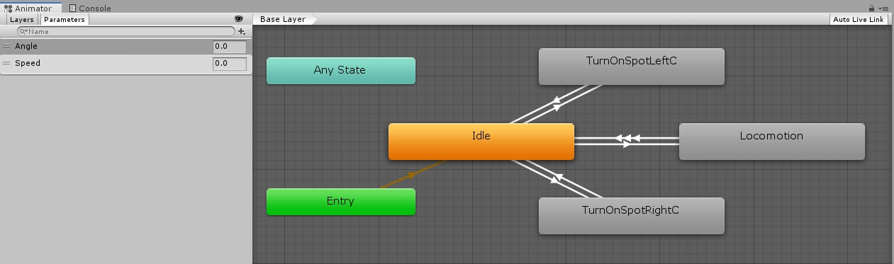
    </td>
  </tr>
</table>

With the following transition settings:

- `Idle` to `Locomotion`:
  - Forward: `Speed` > 0.1
  - Backward: 
    - all 3 condition satisfied simultaneously:
      - `Speed` < 0.1
      - `Angle` > -80
      - `Angle` < 80
    - `Angle` > 80
    - `Angle` < -80
- `Idle` to `TurnOnSpotLeftC`:
  - Forward: `Angle` < -80
  - Backward: `Angle` > -40
- `Idle` to `TurnOnSpotRightC`:
  - Forward: `Angle` > 80
  - Backward: `Angle` < 40

The `NavAgentRootMotion.cs` file has been attached below with only Fields, `Start()`, `Update()` and `OnAnimatorMove()` shown as only these are deviated from the last script:

<details><summary>CLICK ME TO VIEW CODE</summary>
<p>

```c#
using System.Collections;
using System.Collections.Generic;
using UnityEngine;
using UnityEngine.AI;

// the attribute here will automatically bring a Nav Mesh Agent when attached to an object
[RequireComponent(typeof(NavMeshAgent))]
public class NavAgentRootMotion : MonoBehaviour {
    // Inspector Assigned Variable
    public AIWaypointNetwork WaypointNetwork = null;

    public int  CurrentIndex = 0;
    public bool HasPath      = false;
    public bool PathPending  = false;
    public bool PathStale    = false;

    public NavMeshPathStatus PathStatus = NavMeshPathStatus.PathInvalid;

    // Jump Curve used for later off mesh link manipulations
    public AnimationCurve JumpCurve = new AnimationCurve();

    public bool MixedMode = true;


    // Private Members (cache reference to it later)
    private NavMeshAgent _navAgent    = null;
    private Animator     _animator    = null;
    private float        _smoothAngle = 0.0f;

    // Use this for initialization
    void Start() {
        // Cache NavMeshAgent Reference
        _navAgent = GetComponent<NavMeshAgent>();
        _animator = GetComponent<Animator>();

        // Tell the nav mesh agent not to update the rotation of the game object
        // but still update the position
        //_navAgent.updatePosition = false;
        _navAgent.updateRotation = false;

        // If not valid Waypoint Network has been assigned then return
        if (WaypointNetwork == null) return;

        // prototyping to test the navigation works
        //if (WaypointNetwork.Waypoints[CurrentIndex] != null) {
        //  // due that `Waypoints` is a transform, we fetch the position of that
        //  _navAgent.destination = WaypointNetwork.Waypoints[CurrentIndex].position;
        //}

        SetNextDestination(false);
    }

    void Update() {
        // Copy NavMeshAgents state into inspector visible variables
        HasPath     = _navAgent.hasPath;
        PathPending = _navAgent.pathPending;
        PathStale   = _navAgent.isPathStale;
        PathStatus  = _navAgent.pathStatus;

        // Transform agents desired velocity into local space
        Vector3 localDesiredVelocity = transform.InverseTransformVector(_navAgent.desiredVelocity);

        // Get angle in degrees we need to turn to reach the desired velocity direction
        float angle = Mathf.Atan2(localDesiredVelocity.x, localDesiredVelocity.z) * Mathf.Rad2Deg;

        // Smoothly interpolate towards the new angle
        // not able to rotate more than 80 degrees in a second
        _smoothAngle = Mathf.MoveTowardsAngle(_smoothAngle, angle, 80.0f * Time.deltaTime);

        // Speed is simply the amount of desired velocity projected onto our own forward vector
        float speed = localDesiredVelocity.z;

        // Set animator parameters
        _animator.SetFloat("Angle", _smoothAngle);
        _animator.SetFloat("Speed", speed, 0.1f, Time.deltaTime);

        // only use the design velocity to update hte rotation of our game object
        // if we have a valid desired velocity vector that has some length to it
        if (_navAgent.desiredVelocity.sqrMagnitude > Mathf.Epsilon) {
            // layerIndex 0 is Base Layer
            if (!MixedMode ||
                (MixedMode && Mathf.Abs(angle) < 80.0f &&
                 _animator.GetCurrentAnimatorStateInfo(0).IsName("Base Layer.Locomotion"))) {
                // create a new location quaternion that can be assigned to the rotation member of the transform
                // that describes a rotation of the game objects such that it is looking in the direction of the mesh agent
                Quaternion lookRotation = Quaternion.LookRotation(_navAgent.desiredVelocity, Vector3.up);

                // _navAgent.desiredVelocity can be slightly spiky, need to smoothly move from the transforms current rotation towards this rotation
                transform.rotation = Quaternion.Slerp(transform.rotation, lookRotation, 5.0f * Time.deltaTime);
            }
        }

        ...
    }

    // ----------------------------------------------------------------------
    // Called by Unity to allow application to process and apply root motion
    // ----------------------------------------------------------------------

    // this function override the Apply Root Motion --> see `Handled by Script` in Nav Mesh Agent component
    void OnAnimatorMove() {
        // If we are in mixed mode and we are not in the Locomotion state then apply root rotation
        if (MixedMode && !_animator.GetCurrentAnimatorStateInfo(0).IsName("Base Layer.Locomotion")) {
            // rotation has been completely taken care of by our animation
            transform.rotation = _animator.rootRotation;
        }

        // Override Agent's velocity with the velocity of the root motion
        _navAgent.velocity = _animator.deltaPosition / Time.deltaTime;
    }

    ...
}
```
</p>
</details>

<table>
  <tr>
    <th>Root Motion applied, mixing with Nav Agent</th>
  </tr>
  <tr>
    <td>
      
    </td>
  </tr>
</table>

> As you can see the Agent is now glaringly not affected by the sliding since the animation is taking control however, poses an equivocal direction he is currently facing which is due to the conflict between the animation and the navigation where the animation controller has to find a certain permutation of turning angles to let the agent faces the outward direction.

<table>
  <tr>
    <th>Alternative Hybrid of No Root Motion Class with Root motion applied</th>
  </tr>
  <tr>
    <td>
      
    </td>
  </tr>
</table>

> As you can see the Agent's speed is governed now by the Animation clip rather than the navigation AI since it's accelerating, it also frequently stuck into the dead ends.


<br />

----------

## Nomenclature

#### Definitions

- [Voxel](http://whatis.techtarget.com/definition/voxel): A voxel is a unit of graphic information that defines a point in three-dimensional space. A cube of space or a polygon on a 2D mesh.  
- [Off-Mesh Links](https://docs.unity3d.com/Manual/class-OffMeshLink.html): Generated shortcuts which allow the traversal over broken voxels.
- [AI.NavMeshAgent](https://docs.unity3d.com/ScriptReference/AI.NavMeshAgent.html) Documentation
- In Place Animation: Animations which are independent of position. Can often result in a phenomenon known as 'skating' where a character seems to float or skate. Resolved by using animations with 'root motion'.
- [Mixamo](https://www.mixamo.com/#/): Great resource for models, animations.... etc
- **Hashes**: The unity system uses hash values to identify objects and parameters. When retrieving entities with a string it is better to pre-compute the hash value then search for that hash. 
- Anything Physics related should be updated in the `FixedUpdate` method as it is called once per physics step rather than once per frame.


